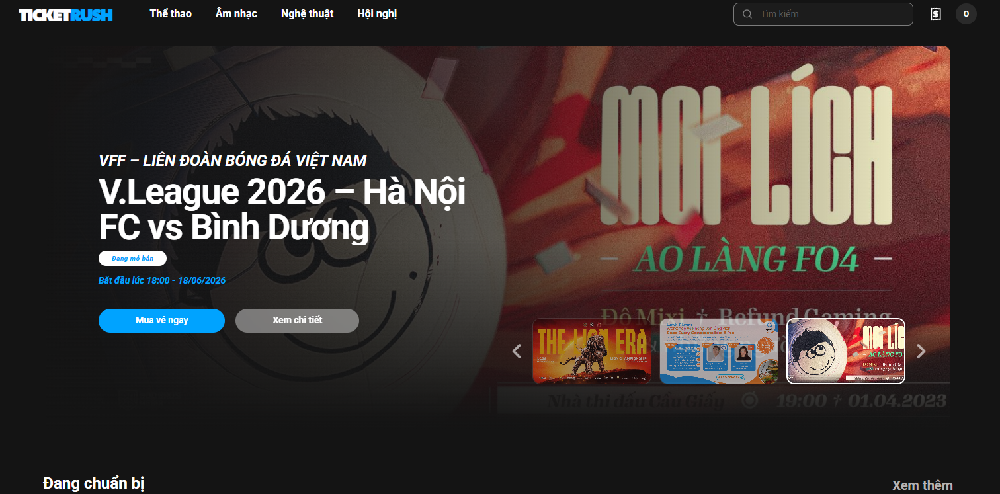
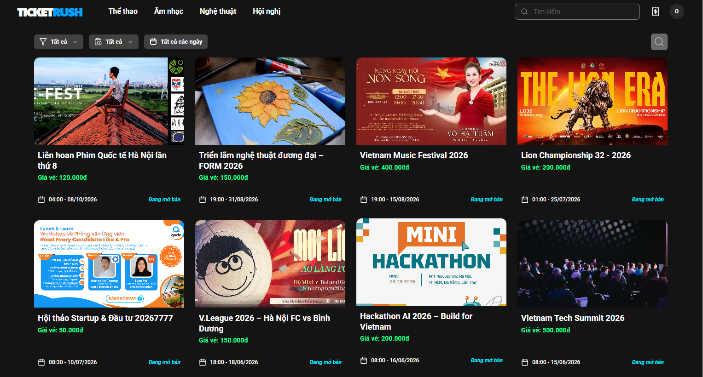
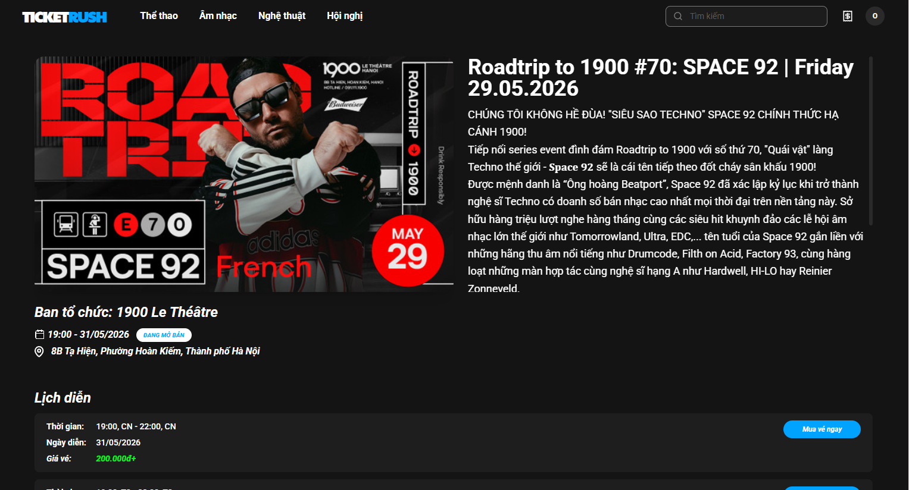
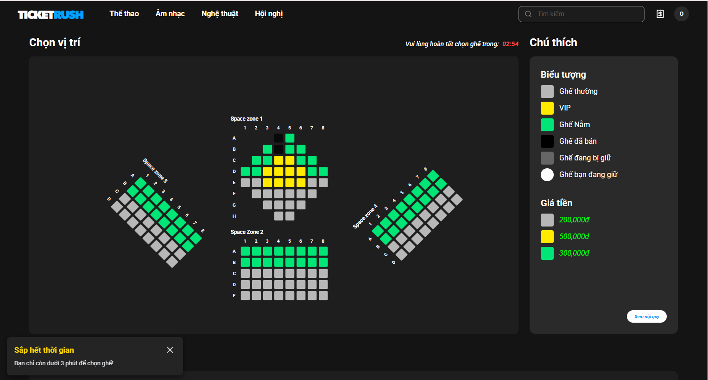
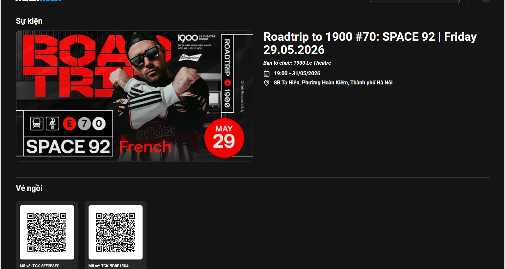
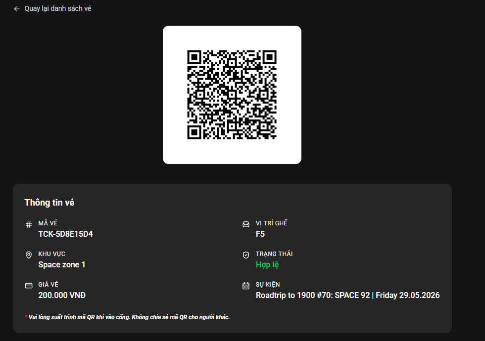
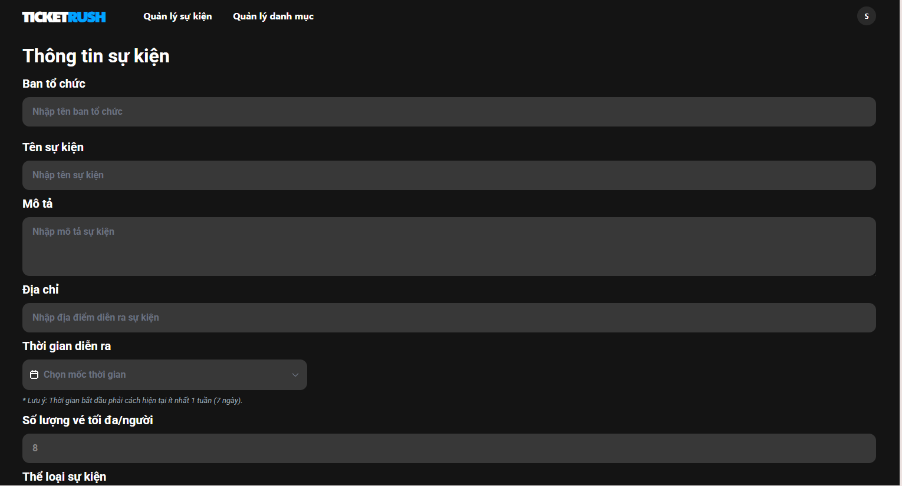
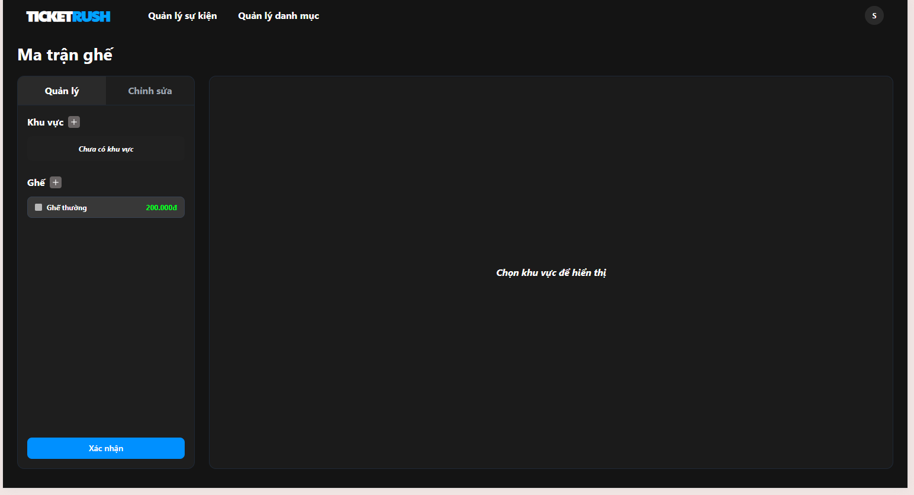
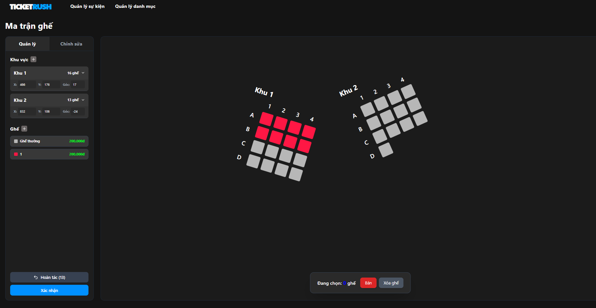

# TicketRush

> **Live Demo / Deploy Link:** [http://20.191.147.59/](http://20.191.147.59/)

**TicketRush** là nền tảng phân phối vé sự kiện (âm nhạc, giải trí, thể thao) được thiết kế đặc biệt để có thể xử lý **lưu lượng truy cập khổng lồ** trong thời gian ngắn. Hệ thống đảm bảo trải nghiệm mua vé, chọn ghế mượt mà theo thời gian thực, **ngăn chặn tuyệt đối tình trạng bán trùng ghế (overbooking)**, và tích hợp **cơ chế block ngăn chặn các hành vi gian lận** khi đặt vé. Ngoài ra nền tảng còn cung cấp giao diện sự kiện, sơ đồ ghế nổi bật, đa dạng với nhiều loại hình thức vé sự kiện khác nhau.

---

##  Tính năng nổi bật

### Người dùng
- **Xử lý Flash Sale:** Hàng chờ (Queue) công bằng, chịu tải cao trong các đợt mở bán vé quy mô lớn.
- **Chọn ghế Real-time:** Hiển thị trạng thái ghế theo thời gian thực, khóa ghế tạm thời (Lock) khi đang thanh toán.
- **Bảo mật, Chống trùng & Chống gian lận:** Quản lý giao dịch an toàn (Transaction), đảm bảo tính nhất quán dữ liệu (ACID), cùng **cơ chế block tự động** ngăn chặn các hành vi gian lận, spam khi đặt vé.
- **Giao diện hiện đại:** Responsive trên mọi thiết bị, thao tác chọn ghế trực quan.
- **Vé điện tử (E-Ticket):** Tích hợp QR Code để check-in tại sự kiện nhanh chóng.

### Admin
- **Tạo và quản lý sự kiện:** Đăng tải thông tin sự kiện, bao gồm poster, mô tả và thông tin thời gian.
- **Thiết kế sơ đồ ghế:** Tùy chỉnh layout và cấu trúc khu vực chỗ ngồi cho từng sự kiện. Hỗ trợ kéo, thả, thu phóng, cắt ghép sơ đồ ghế một cách đa dạng.
- **Thiết lập giá vé và phiên mở bán:** Quản lý các mức giá khác nhau và lên lịch các giai đoạn bán vé.
- **Theo dõi doanh thu và báo cáo:** Giám sát hiệu suất bán vé thông qua biểu đồ và số liệu realtime.

---
## Giao diện minh họa

### 1. Giao diện Người dùng (Customer)
**Trang chủ:**


**Danh sách sự kiện:**


**Chi tiết sự kiện:**


**Chọn ghế (Real-time):**


**Hóa đơn & Thanh toán:**


**Vé điện tử (QR Code):**


### 2. Giao diện Quản trị viên (Admin)
**Tạo sự kiện mới:**


**Tạo ma trận & Sơ đồ ghế:**




---
## Công nghệ sử dụng

### **Frontend**
- **Framework:** React 18 + TypeScript + Vite
- **Styling:** Tailwind CSS
- **State Management:** Zustand
- **Routing:** React Router DOM
- **Khác:** Axios, Recharts, Lucide React

### **Backend**
- **Core:** Java 17, Spring Boot 3
- **Database (RDBMS):** PostgreSQL (thông qua Supabase)
- **ORM:** Hibernate (Spring Data JPA)
- **Caching & Queue:** Redis (Upstair)
- **Security:** Spring Security, OAuth2 Resource Server, Supabase Auth, JWT (JSON Web Token), HttpOnly Cookies
- **Real-time & Tài nguyên:** WebSockets (thông qua Supabase), Supabase Storage (lưu trữ ảnh, tài nguyên tĩnh)
- **Tiện ích:** Lombok, ZXing (Tạo QR Code), Springdoc OpenAPI (Swagger UI)

---

## Hướng dẫn cài đặt

### 1. Yêu cầu hệ thống (Prerequisites)
- [Node.js](https://nodejs.org/en) (phiên bản 18.x trở lên)
- [Java Development Kit (JDK) 17](https://adoptium.net/temurin/releases/) trở lên.
- [Redis](https://redis.io/download) (hoặc chạy qua Docker: `docker run -p 6379:6379 -d redis`).
- IDE khuyên dùng: **VS Code** (Extension Pack for Java & Spring Boot) hoặc **IntelliJ IDEA**.

### 2. Thiết lập Database (Supabase)
Dự án sử dụng Supabase làm CSDL chính và quản lý người dùng:
1. Tạo project trên [Supabase](https://supabase.com).
2. Lấy thông tin chuỗi kết nối **PostgreSQL** điền vào `application.yml` hoặc file `.env` của Backend.
3. Lấy **Project URL** và **Anon Key** điền vào file `.env` của Frontend.

### 3. Khởi chạy Backend (Spring Boot)
Mở Terminal ở thư mục gốc của project:
```bash
# Chuyển vào thư mục backend
cd backend

# Chạy ứng dụng (Windows)
.\mvnw spring-boot:run

```
> *Lưu ý: API Backend mặc định chạy tại cổng `http://localhost:8081`.*
> *Tài liệu API (Swagger): `http://localhost:8081/swagger-ui.html`*

### 4. Khởi chạy Frontend (React + Vite)
Mở một cửa sổ Terminal **mới**:
```bash
# Chuyển vào thư mục frontend
cd frontend

# Cài đặt các gói thư viện
npm install

# Khởi chạy server giao diện
npm run dev
```
> *Truy cập ứng dụng tại: `http://localhost:5173`*

---

## Cấu trúc thư mục dự án

```text
TicketRush/
├── backend/               # Mã nguồn Java Spring Boot API
│   ├── src/main/java/     # Logic nghiệp vụ (Controller, Service, Repository, DTO)
│   ├── src/main/resources/# Cấu hình (application.yml, .env)
│   └── pom.xml            # Quản lý thư viện Maven
│
├── frontend/              # Mã nguồn ReactJS
│   ├── src/               # Components, Pages, Hooks, Store, Services
│   ├── package.json       # Quản lý thư viện NPM
│   ├── tailwind.config.js # Cấu hình TailwindCSS
│   └── vite.config.ts     # Cấu hình Vite
│
└── load-test-queue.js     # Kịch bản k6 Load Testing
```

---

## Kịch bản kiểm thử hiệu năng (Load Testing)
Dự án đi kèm script kiểm thử khả năng chịu tải hàng chờ bằng **k6**.
Để chạy kiểm thử (yêu cầu cài đặt [k6](https://k6.io/)):
```bash
k6 run load-test-queue.js

# Hoặc thiết lập cấu hình chạy tùy biến:
k6 run --vus 300 --duration 30s load-test-queue.js
```